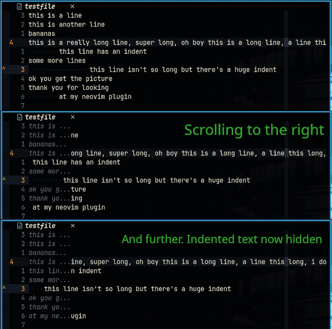

# truncateline.nvim



## Important
Upon first installing I notice an error about namespaces, Just exit Neovim and it will be gone when you enter it again. I'll figure out what's going on there because it's a bit amateurish.

### About

A Neovim plugin for the prevention of getting lost when scrolling off into the yonder. When no longer visible, truncateline will display the first n characters of non-whitespace text of a line as virtual text. Now the text will appear to be truncated, which just adds another solution for dealing with very long lines, instead of having to rely on wrapping which is difficult to follow sometimes. This is very handy for editing database files and HTML, as well as pretty much anything a tiling window manager user might like to edit on a laptop. One way to use this would be to have it always on, and let the first 8 characters appear should you scroll to the right. This is the default, but it may be preferable to set the plugin to disabled, set a longer character count, and instead use the temporary toggle feature for a quick reminder, should you need it.

### Features
+ Have the option to turn it on or off at start up.
+ As well as a toggle function, a key can also be bound to temporarily toggle between on and off.
+ Character count, truncation string, temporary toggle duration and hilight group can also be configured.

### Install and configuration
For Lazy, I suggest setting lazy loading to false. Just in case you like to bind your keys with Lazy, which will prevent the plugin from starting until they are used.
```
    { "rlychrisg/truncateline.nvim", lazy = false },
```
The plugin will also need to be called somewhere with `require('truncateline').setup()`.

For a default configuration:
```
    {
        "rlychrisg/truncateline.nvim",
        lazy = false,
        config = function ()
            require('truncateline').setup({

                enabled_on_start = true,

                -- the truncate_str will be appended to virtual text to help
                -- distinguish it from the actual text. to remove it entirely
                -- just delete the contents of the quotes, leaving "".
                truncate_str = "...",

                -- how many characters from the start of the line should be
                -- displayed. note: you might want the total of this setting,
                -- along with truncate_str, to be less than your sidescrolloff
                -- setting, to prevent obscuring text.
                line_start_length = 8,

                -- for the temporary toggle function, this sets the time in ms
                -- before returning to on/off.
                temporary_toggle_dur = 2000,

                -- which hilight group should be used for the virtual text.
                -- "Comment", or "Normal" are good choices, but anything in
                -- :highlight can be used.
                hilight_group = "Comment"
            })
        end
    }
```

### Setting keybinds
No default keybinds are set because I like to avoid breaking other plugins. This means you'll have to come up with your own though. Here are my suggestions, and feel free to use both, either, or neither.
```
    vim.api.nvim_set_keymap('n', '<leader>l', ':lua require("truncateline").TemporaryToggle()<CR>',
    {  noremap = true, silent = true, desc = "TruncateLine temporary toggle" })
    vim.api.nvim_set_keymap('n', '<leader>sl', ':lua require("truncateline").ToggleTruncate()<CR>',
    { noremap = true, silent = true, desc = "TruncateLine toggle" })
```

### A note about contributions and suggestions
Both are welcome but I'm a bit of a beginner in both lua and git, so please be patient and err on the side of patronising when explaining stuff.


